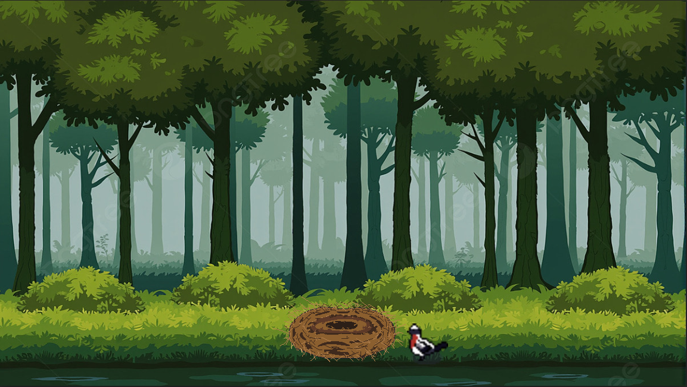

# 2026-303-The-Last-Egg

## Grupo
- Arthur Guedes → Programação e Animação  
- Davi Elias → Preenchimento do README e Programação  
- Francisco → Preenchimento da GDC e Slides  
- Arthur Fernando → Programação e Commits  
- Samuel → História e Design  
- Marcelo → Design da GDC e Design do Background

## O último ovo

O jogo "O último ovo" retrata a jornada do pássaro Falco em busca de restaurar a sua espécie que esta em risco de extinção. Durante a jornada Falco vai passar por vários desafios como derrotar predadores e conquistar territórios para impedir que sua espécie seja extinta.

## Planilha de Acessibilidade
[https://docs.google.com/spreadsheets/d/1hMr2mcNMs9up31D6zCn5308dHRLsqw0JQCNbnnlR_M4/edit?gid=107741830#gid=107741830](https://docs.google.com/spreadsheets/d/1XuxAyzaIyeWTHdETyp4iNFoG6s2PkvmLaqgAllg6Qu4/edit?usp=sharing)

## Tecnologias
- Godot Engine (4.5 Stable)

## Pré-requisitos
- Godot Engine (4.5 Stable)
  
## Ferramentas de Desenvolvimento
- Aseprite (para criação de sprites e animações)

## Tela Inicial 

- Na tela inicial do nosso jogo possui uma animação curtinha feito no aplicativo Aseprite com uma música tocando de fundo e com efeitos sonoros para cada frame da animação.
- Você pode acessar o nosso menu apertando o espaço.

## Menu Principal

 O menu principal apresenta três botões, cada um deles apresenta diferentes funcionalidades:

  - **Jogar:** Inicia o jogo e leva o jogador para primeira cena do jogo, onde o protagonista Falco vai estar em seu ninho cuidando de seu filhote (provavelmente será adicionado uma cutscene inicial posteriormente).
  - **Configurações:** Leva ao painel de configurações do jogo.
  - **Sair:** Faz sair do jogo.

## Configurações

Nas configurações do nosso jogo, até o momento, há controle de volume básico (geral, música e efeitos sonoros). Atualmente, temos duas acessibilidades disponíveis: daltonismo e modo de alto contraste. Os tipos de daltonismo disponíveis são Protanopia, Deuteranopia e Tritanopia. No modo de alto contraste, todas as cores são realçadas para oferecer acessibilidade àqueles que têm baixa acuidade visual. No futuro, planejamos mudar toda a interface do usuário e também implementar o remapeamento de controles. Todas as alterações e/ou modificações nas configurações são salvadas e aplicadas ;-]

## Primeira Cena

- Inicialmente temos um placeholder de um cenário para o ninho e o protagonista, o passáro atualmente só consegue andar e pular pelo ninho, entretanto futuramente será adicionado novas mecânicas como um pequeno voo e ataques.

## GDC (Game Design Canvas)

## !! Avisos para modificação e/ou debug !!

-Sempre importe pelo godot caso for usar o zip do nosso projeto!!!! Se você tentar importar manualmente não será reconhecido os arquivos .godot e o project.godot

-Caso não conseguir executar mesmo seguindo esses passos,por favor me contata:a2023951334@teiacoltec.org.
  
## Slides

Slides: https://canva.link/0gx7ckfm0sdpbou

