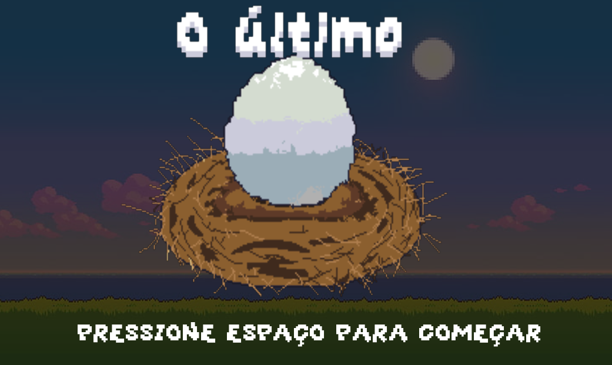
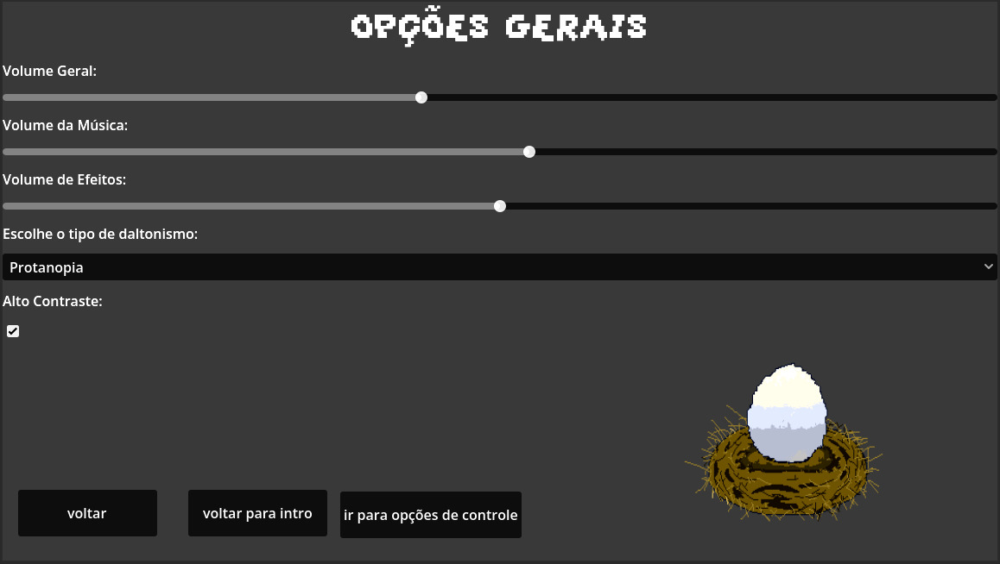

# 2026-303-The-Last-Egg

## Grupo
- Arthur Fernando
- Arthur Guedes
- Davi Elias
- Francisco Almeida
- Marcelo Pezzini
- Samuel Hanry

## O último ovo

O jogo "O último ovo" retrata a jornada do passaro Falco em busca de restaurar a sua espécie que esta em risco de estinção. Durante a jornada Falco vai passar por vários desafios como derrotar predadores e conquistar territórios para impedir que sua espécie seja extinta.

## Planilha de Acessibilidade
https://docs.google.com/spreadsheets/d/1hMr2mcNMs9up31D6zCn5308dHRLsqw0JQCNbnnlR_M4/edit?gid=107741830#gid=107741830

## Tecnologias
- Godot Engine (4.5 Stable)

## Pré-requisitos
- Godot Engine (4.5 Stable)
  
## Ferramentas de Desenvolvimento
- Aseprite (para criação de sprites e animações)

## Tela Inicial 

- Na tela inicial do nosso jogo possui uma animação curtinha feito no aplicativo Aseprite com uma música tocando de fundo e com efeitos sonoros para cada frame da animação.
- Você pode acessar o nosso menu apertando o espaço.

## Menu Principal

 O menu principal apresenta três botões, cada um deles apresenta diferentes funcionalidades:

  - **Jogar:** Inicia o jogo, porém atualmente ele ainda não possui os elementos do projeto final, sendo apenas um placeholder.
  - **Configurações:** Leva ao painel de configurações do jogo.
  - **Sair:** Faz sair do jogo

## Configurações

Nas configurações possuímos apenas a configuração do volume. Realmente ficou a desejar em termos de acessibilidade, mas as configurações possuem um arquivo singleton/global que salva suas preferências mesmo após o fechamento do jogo. Possui alguns botões de teste para verificar se o volume funciona (obs: funciona de verdade :) ).

